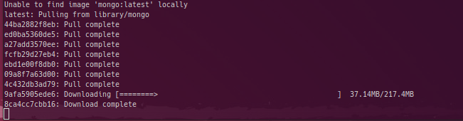

# プロジェクト専用のMongoDB環境をUbuntu 20.04で構築する


## 背景
- 顔認識システムで、URL、512次元の数値配列、検索結果などを効率よく保存・検索したい。
- MongoDBの高度なインデックス作成機能がこの用途に適している。
- Ubuntu 20.04を使用しており、システム全体に影響を与えずにMongoDBを導入したい。

## 解決策
Dockerを使用して、プロジェクト専用のMongoDB環境を構築する。

## 手順

### 1. Dockerのインストール
Ubuntu 20.04にDockerをインストールする。
#### Dockerがインストールされているか確認
```bash
docker --version
sudo systemctl status docker
```
インストールされていなければ、以下のURLを参照してインストールする。
[Install Docker Desktop on Ubuntu](https://docs.docker.com/desktop/install/ubuntu/)

### 2. MongoDBのDockerコンテナを起動
専用のディレクトリ（例：`/home/terms/bin/mongodb`）でMongoDBのDockerコンテナを起動する。
```bash
docker run --name my-mongodb -v /home/terms/bin/mongodb/data:/data/db -p 27017:27017 -d mongo
```


### 3. Python仮想環境の作成
同じディレクトリ内でPythonの仮想環境を作成する。
```bash
python3 -m venv .
```

### 4. 仮想環境をアクティブにする
```bash
source ./bin/activate
```

### 5. MongoDBのPythonドライバーをインストール
```bash
pip install pymongo
```

---

## FaissとMongoDBを組み合わせたダミーデータの検索

### 必要なパッケージのインストール
```bash
pip install pymongo
pip install faiss-cpu  # CPU版
```

### コード例
以下のPythonコードは、MongoDBにダミーデータを挿入し、Faissで検索を行い、その結果をMongoDBに保存する一連の流れを示しています。

```python
from pymongo import MongoClient
import numpy as np
import faiss

# MongoDBに接続
client = MongoClient('localhost', 27017)
db = client['my_database']
collection = db['my_collection']

# ダミーデータを作成（512次元のベクトル、10個）
dummy_data = np.random.rand(10, 512).astype('float32')

# MongoDBにダミーデータを挿入
for i, vec in enumerate(dummy_data):
    collection.insert_one({'index': i, 'vector': vec.tolist()})

# Faissのインデックスを作成
index = faiss.IndexFlatL2(512)
index.add(dummy_data)

# 検索用のクエリベクトルを作成（512次元）
query_vector = np.random.rand(1, 512).astype('float32')

# Faissで検索
k = 3  # 近傍点数
D, I = index.search(query_vector, k)

# 検索結果をMongoDBに保存
for i in I[0]:
    doc = collection.find_one({'index': int(i)})
    collection.update_one({'index': int(i)}, {'$set': {'is_similar': True}})

print("Faissでの検索とMongoDBへの結果保存が完了しました。")
```

---

## まとめ
- Dockerを使用することで、システム全体に影響を与えずにMongoDBを導入できる。
- Pythonの仮想環境内でMongoDBのPythonドライバー（PyMongo）をインストールすることで、プロジェクト専用の環境を構築できる。
- FaissとMongoDBを組み合わせることで、高次元のベクトルデータに対する効率的な検索と保存が可能。

---

この内容で技術ブログに書く際の参考になれば幸いです。何か他に質問や追加したい点があれば、どうぞお知らせください。